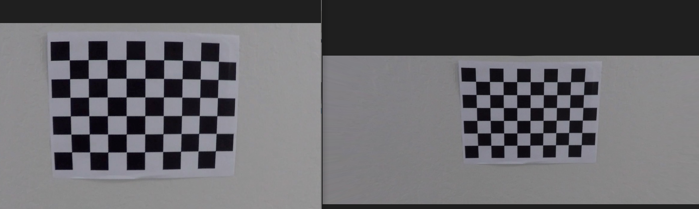
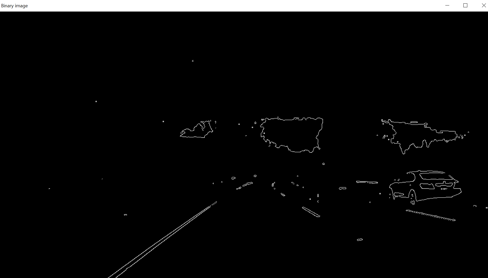
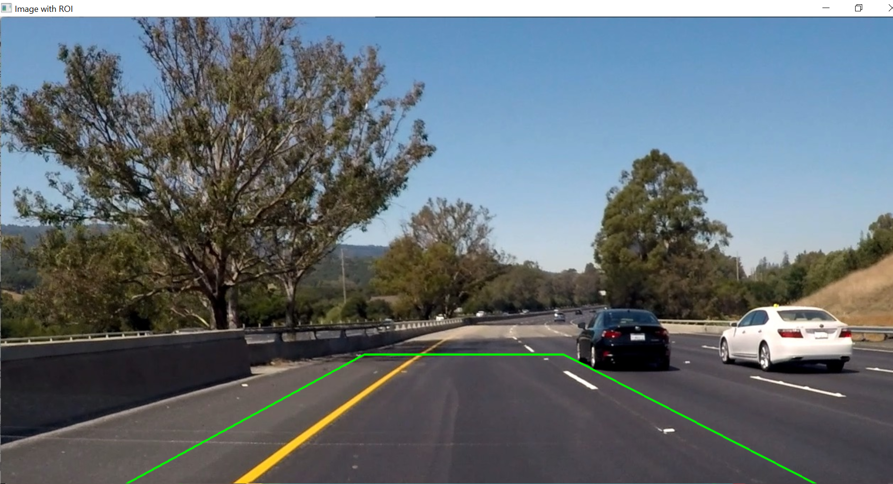
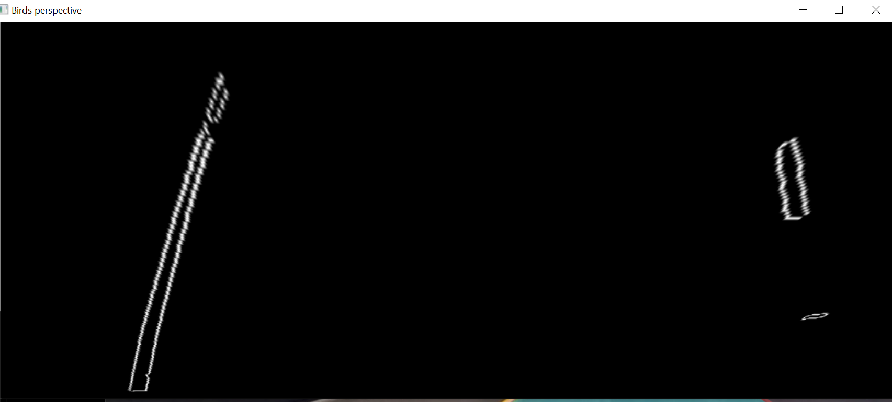
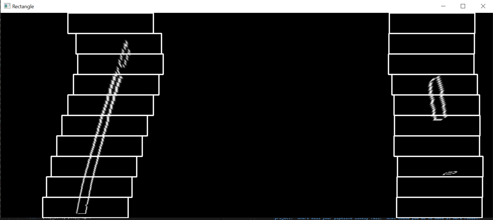
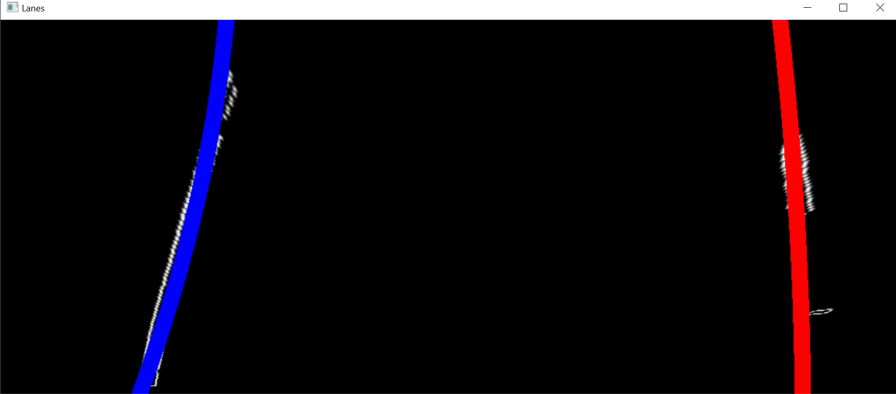
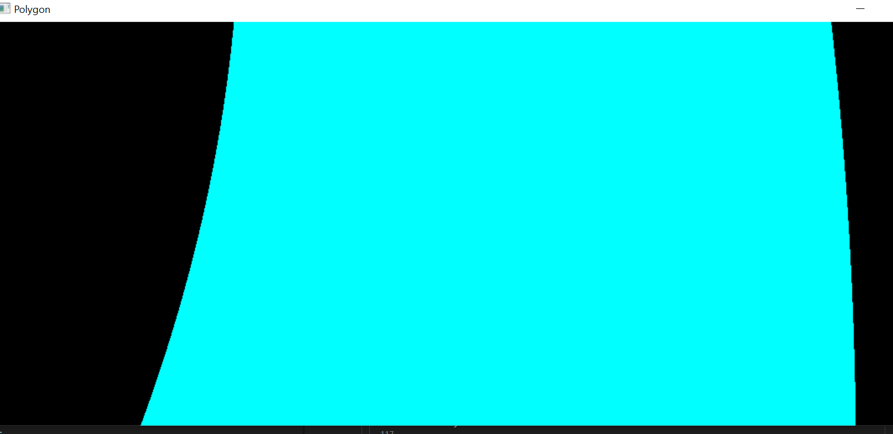
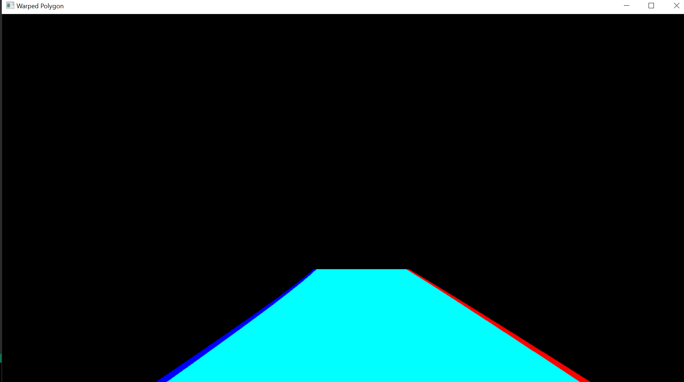
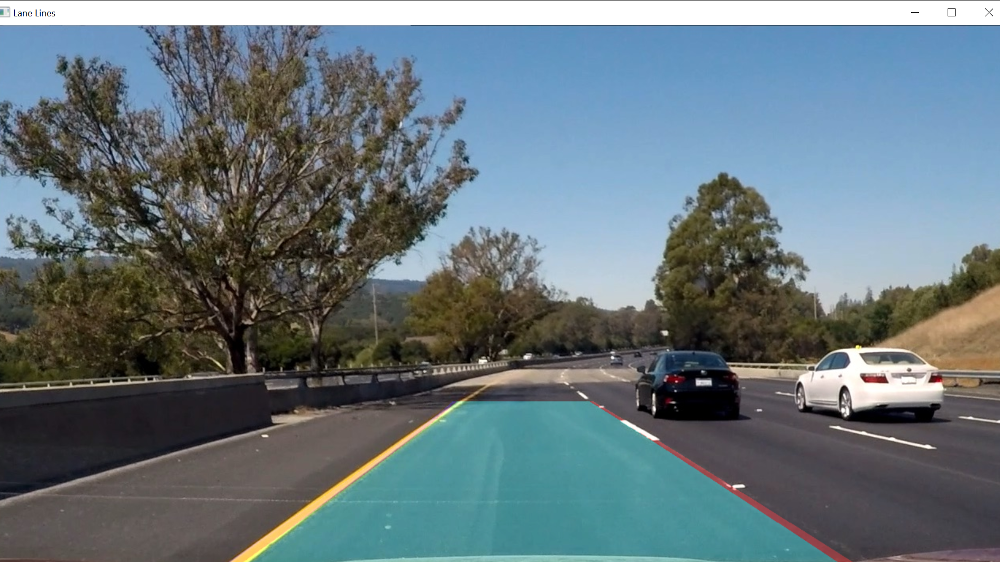

## Writeup Template

### You use this file as a template for your writeup.

---

**Lane Finding Project**

The goals / steps of this project are the following:

* Compute the camera calibration matrix and distortion coefficients given a set of chessboard images.
* Apply a distortion correction to raw images.
* Use color transforms, gradients, etc., to create a thresholded binary image.
* Apply a perspective transform to rectify binary image ("birds-eye view").
* Detect lane pixels and fit to find the lane boundary.
* Determine the curvature of the lane and vehicle position with respect to center.
* Warp the detected lane boundaries back onto the original image.
* Output visual display of the lane boundaries and numerical estimation of lane curvature and vehicle position.

[//]: # (Image References)

[image1]: ./examples/undistort_output.png "Undistorted"
[image2]: ./test_images/test1.jpg "Road Transformed"
[image3]: ./examples/binary_combo_example.jpg "Binary Example"
[image4]: ./examples/warped_straight_lines.jpg "Warp Example"
[image5]: ./examples/color_fit_lines.jpg "Fit Visual"
[image6]: ./examples/example_output.jpg "Output"
[video1]: ./project_video.mp4 "Video"

---

### Writeup / README

#### 1. Provide a Writeup that includes all the rubric points and how you addressed each one.

You're reading it!

### Camera Calibration

#### 1. Briefly state how you computed the camera matrix and distortion coefficients. Provide an example of a distortion corrected calibration image.
Calibration is done in calibration.py file. 
For every chess board image provided I have used findChessboardCorners. Number of corners given is 54 (9*6).
If 54 corners is found return is true. Then corners are beiing refined , and they are all sent to calibrateCamera which produces matrix and distorition coefficients. 
All Corners not found for image: camera_cal\calibration1.jpg ,camera_cal\calibration4.jpg ,camera_cal\calibration5.jpg, because 53 is seen on image .
Output: 'output_undistorted_images'

Note: Camera calibration was skiped on images because of problems whit warp-ing.
There were two problems. First it was easy to make a trapezoid generic on original images, but when they become undistorted it was very hard.
So solution could be to first convert to birds perspective and then undistor but for some reason after warp-ing poligon was all black. 
Didn't find solution. I have spent a lot of time trying to make trapezoid generic enoguh to fit all undistored images but couldn't do it. 
So thats why undistor step is commented out. 

### Pipeline (single images)

#### 1. Provide an example of a distortion-corrected image.

TODO: Add your text here!!!

#### 2. Describe how (and id entify where in your code) you used color transforms, gradients or other methods to create a thresholded binary image.  Provide an example of a binary image result.
First image is converted to gray. 

Then gausian blur is done with dimension 3x3 matrix to reduce redundant info. 3x3 is choosen experimentaly, 5x5 was too much of a blur and on some images lines won't be visible.

Threshold is also choosen experimentaly (190). Pixels below this will be converted to zero. 
Lower threshold for example 150 works for most of the pictures, but for pictures liike picture1 with bright lighting it won't work(because
all pixels have higher values.)

Then canny edges detection is done.

binary_converter.py class in code.

#### 3. Describe how (and identify where in your code) you performed a perspective transform and provide an example of a transformed image.
Perspective transform has been done ini birds_perspective_converter.py

First I have selected regiion of interest. This was done experimentaly by drawing a trapezoid. 
Then new dimensions are specified, in order to fit the whole trapezoiid maximum is taken from top and bottom width for right sided dots.
Then get perspective transform and warp are done. 

#### 4. Describe how (and identify where in your code) you identified lane-line pixels and fit their positions with a polynomial?
lines_detector.py detects lines. 
Detection is performed with sliding window technique.(First I tried hough but it was unsucessful)

I create windows, left windows are for left lane and right for right lane. 

To start we need to find base on x ahis. It is the hiighest point in histogram (picture divided in half for two lanes.)
By taking the histogram we ensure that windows will at least find some pixels and and be able to recenter. 
Window will recenter to position with if number of pixels found is enoguh : 
base = int(np.mean(nonzerox)) - recenter to mean of nonzero pixels .

All nonzeros are added to output and it is used in polyfit function that fits their positions by polinomial.

After that in cv_to_human_vision.py - lines and poligon are drawn on original image .
roi, new_dim and M (matrix) from transforming to birds perspective are now used in inverse  
way in order to put them back to original image. 
Warp is done and result merged to original.

#### 5. Describe how (and identify where in your code) you calculated the radius of curvature of the lane and the position of the vehicle with respect to center.
/

#### 6. Provide an example image of your result plotted back down onto the road such that the lane area is identified clearly.

### Pipeline (video)

#### 1. Provide a link to your final video output.  Your pipeline should perform reasonably well on the entire project video (wobbly lines are ok but no catastrophic failures that would cause the car to drive off the road!).
Videos are in output folder.
- [Video 1](output/processed_video.mp4)
- [Video 2](output/processed_video1.mp4)
- [Video 3](output/processed_video2.mp4)

### Discussion

#### 1. Briefly discuss any problems / issues you faced in your implementation of this project.  Where will your pipeline likely fail?  What could you do to make it more robust?

- As I have already mentioned , I had a problem finding generic trapezoid after calibratiion. I might be that calibration parameters are not good, or warp params are not
  good , but didn't find the solution .

- Sliding windows base not ok. First blok takes x coordinate of highest point in histogram, but when line is curved it can happen than block is just black.

-  Conversion to binary image made me lose a lot of useful information. Maybe I should have changed perspective to birds view and then used Sobel by x axis.
  On challenges and difficult images I don't have enough of information in order to detect where the lines at.

